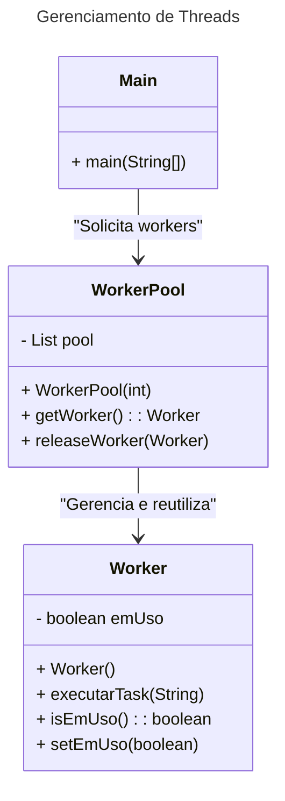

## Motivação
Imagine um sistema que precisa executar várias tarefas pesadas, como processamento de arquivos. Criar e destruir threads constantemente pode ser ineficiente. Para otimizar, utilizamos o padrão Object Pool para gerenciar um conjunto fixo de threads reutilizáveis.

## Estrutura

## Participantes
- Worker (Reutilizável): Representa um trabalhador que pode executar tasks. Ele tem um estado (emUso) que define se está disponível ou ocupado.
- WorkerPool (Gerenciador do Pool): Gerencia um conjunto fixo de workers reutilizáveis, permitindo pegar e liberar workers conforme necessário. Se todos os workers estiverem ocupados, a requisição falha temporariamente.
- Main (Cliente): Simula um programa que solicita workers do pool, atribui tasks a eles e depois os libera para reutilização.

### Explicação
O WorkerPool cria um número fixo de workers (exemplo: 2). Quando uma task precisa ser executada, o Main solicita um worker com getWorker(). Se houver um worker disponível, ele é marcado como em uso e executa a task.Quando a task termina, o worker é liberado de volta para o pool com releaseWorker(), ficando pronto para outra task. Se todos os workers estiverem ocupados, o programa exibe "Nenhum worker disponível!", pois não há workers livres no momento.